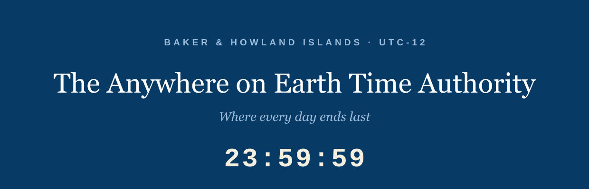

<p align="center">
  
</p>

<p align="center">
  <strong>Where every day ends last.</strong><br>
  Baker &amp; Howland Islands &middot; UTC-12 &middot; The day isn't over until we say so, and we say nothing.
</p>

---

This repository contains the public site for The Anywhere on Earth Time
Authority (aoetimeauthority.org, candidate domain, not yet purchased), the
self-declared custodian of UTC-12, the time zone in which every "Anywhere
on Earth" deadline actually expires.

## The Authority

AoE is real: IEEE, major academic conferences, and standards bodies set
deadlines "Anywhere on Earth", meaning a date has not ended until it ends
in UTC-12. The only land in UTC-12 is Baker Island and Howland Island, two
uninhabited US atolls administered as wildlife refuges. Every 23:59 AoE on
the planet is, formally, 23:59 local time at a place where no one has ever
submitted anything. The Authority exists to keep that clock, in the sense
of displaying it.

## What the site actually does

Everything runs client-side and the arithmetic is real:

* **The official clock** renders UTC-12 continuously, computed as
  `Date.now()` minus twelve hours and displayed with UTC accessors, so the
  device's own zone never leaks in.
* **The deadline checker** takes a date and pronounces it ALIVE or
  DECEASED. End of day AoE is 23:59:59 at UTC-12, which is 11:59:59 UTC
  the following day; the countdown ticks live against that instant.
* **The facts** are checkable: the islands, the Earhart connection, the
  US Fish and Wildlife Service permit requirement, and UTC+14 on
  Kiribati's Line Islands are all part of the record. Only the Authority
  is invented, which it considers a technicality.

---

## Development notes

The parody ends here. The rest of this file is accurate.

### Layout

A static, zero-build, zero-dependency site. Two HTML files and a handful
of generated images. There is no framework, no bundler and no
`package.json`. Cloudflare Pages serves the repository root exactly as it
appears here.

```
index.html            the site, clock and deadline checker included
404.html              catch-all, served automatically by Cloudflare Pages
favicon.svg           icon source of truth (64px grid)
favicon.ico           16/32/48, generated
apple-touch-icon.png  180x180, generated
og.png                1200x630 share image, generated
assets/logo.svg       wordmark, text outlined, used at the top of this README
tools/og.html         source for og.png
tools/logo-src.svg    source for assets/logo.svg, text still live
tools/favicon-16.svg  simplified 16px icon, used for the smallest .ico entry
Makefile              asset regeneration only, never runs at deploy time
_headers              Cloudflare Pages header rules
robots.txt            permissive
wrangler.toml         Cloudflare Pages configuration
mise.toml             pins the Wrangler version used to deploy
```

The page makes zero requests to any external domain. Headings are Georgia
with serif fallbacks and body type is Helvetica Neue with Arial fallbacks,
so there are no webfonts to host or wait for. The agency seal in the page
header is an inline SVG with an embedded raster core; it ships inside
`index.html` and is not a separate asset.

### The production domain

The site is served at `aoe.besteffortindustries.com`, and that is the host every absolute
URL on the page points at, so link previews resolve. `aoetimeauthority.org` remains
the candidate domain and has not been purchased; if the site is
promoted, either to that domain or to a subdomain of the parent
(`aoe.besteffortindustries.com`), the canonical host changes in the
places below and nothing else derives it:

| File | What to change |
| --- | --- |
| `index.html` | `rel=canonical`, `og:url`, `og:image`, `twitter:image` |
| `404.html` | nothing, the 404 uses only root-relative paths |
| `tools/og.html` | the domain printed in the footer of the share image |
| `README.md` | this table, and the mentions above it |

After changing `tools/og.html`, re-run `make og`.

### Local preview

```sh
make serve          # python3 -m http.server 8000
```

Then open `http://localhost:8000`. A local server is preferable to opening
the file directly because the icon paths are root-absolute.

### Regenerating images

Only needed when the wordmark, the icon or the share image changes.
Requires `google-chrome`, ImageMagick 7 (`magick`) and Inkscape on the
machine doing the regenerating; none of them is needed to deploy, because
the outputs are committed. The serif renders want a real Georgia on the
fontconfig path; this machine has one in `~/.local/share/fonts`.

```sh
make assets         # everything below
make og             # og.png     <- tools/og.html, via headless Chrome
make favicon        # favicon.ico + apple-touch-icon.png <- the SVG sources
make logo           # assets/logo.svg <- tools/logo-src.svg, text outlined
```

`make logo` outlines the wordmark's text so the README renders the same
whether or not the viewer has Georgia. Inkscape rewrites the whole file,
so the `GENERATED` comment at the top has to be pasted back afterwards.

### Deploying

Wrangler is configured via `wrangler.toml`, so a deploy is one command
from an authenticated shell:

```sh
make deploy         # wrangler pages deploy .
```

The Wrangler version is pinned by `mise.toml` (this machine manages its
Wrangler through [mise](https://mise.jdx.dev/); the global config tracks
`latest`, the repo pins an exact version). To move the pin, edit
`mise.toml`, run `mise install`, and deploy once to confirm nothing moved
underneath.

### Which Cloudflare account this deploys to

This machine has two Cloudflare identities, and picking the wrong one
deploys this site into an unrelated organisation.

**Pages configuration cannot pin the account.** `account_id` is a
Workers-only key; putting it in a Pages `wrangler.toml` makes Wrangler
refuse to run. So the account is selected by **an auth profile bound to
this directory**, recorded in
`~/.config/.wrangler/profiles/directory-bindings.json`:

```sh
wrangler auth activate personal    # already done; re-run after moving the repo
wrangler whoami                    # must print: Active profile: personal
```

Without a binding, Wrangler falls back to the `default` profile, which
here is the other organisation, and it will deploy there without asking.
**Check `whoami` before deploying.** The binding lives outside the repo,
so a fresh clone, a moved directory, or another machine all need
`wrangler auth activate` again.

One extra trap: Wrangler caches the resolved account in the untracked
`.wrangler/cache/wrangler-account.json` inside this directory. If a deploy
ever went to the wrong account from here, activating the right profile is
**not** enough; delete `.wrangler/` as well, or the cached account ID wins
and the API call fails with `Authentication error [code: 10000]`.

For CI, where profiles do not exist, set `CLOUDFLARE_ACCOUNT_ID` (the
account to deploy into) and `CLOUDFLARE_API_TOKEN` (credentials scoped to
it) as environment variables.

The Pages project is `aoetimeauthority`, production branch `main`, with no
build command and the build output directory set to `/`. If you ever
recreate it from the dashboard, use exactly those values; there is nothing
to build, and any build command entered there will only make the
deployment worse.

To wire the Git integration instead, connect the
`holthe/anywhere-on-earth-time-authority` repository under **Workers &
Pages -> Create -> Pages -> Connect to Git** with the same settings. Note
that the repository name is hyphenated and the Pages project name is not;
the project name matches the domain.

### Custom domain

Deploy at least once first, so the project exists. Then, once
`aoetimeauthority.org` (or whatever the site ends up on) is actually
registered:

1. **Add the zone to Cloudflare**, unless the domain was bought through
   Cloudflare, in which case it is already there. Dashboard -> **Add a
   site** -> the domain -> Free plan. Repoint the registrar's nameservers
   at the two Cloudflare ones and wait for the zone to go active.
2. **Attach the domain to the Pages project.** Dashboard -> **Workers &
   Pages** -> `aoetimeauthority` -> **Custom domains** -> **Set up a
   custom domain**. Because the zone is on Cloudflare, the required CNAME
   record (apex, flattened, proxied, pointing at
   `aoe.besteffortindustries.com`) is created for you. **Do not create the
   record by hand first**; a pre-existing CNAME blocks the flow outright.
3. **Repeat for `www`** if both should resolve.
4. **Wait for the certificate.** Issuance normally completes within a few
   minutes of the record appearing.

Until then the site is reachable at `aoe.besteffortindustries.com`.

### Related

The Authority is a division of
[Best Effort Industries](https://besteffortindustries.com), currently
queued in that register's Schedule B under a provisional number. Real
division numbers are assigned by the register on entry into service,
which is to say when the domain exists, which is to say not yet, which
the Authority notes is not the same as never. It also maintains a formal
rivalry with UTC+14, conducted entirely by never communicating.

## License

Parody. The time zone is real, the islands are real, the deadlines are
real, and the Authority is whatever is left over.
